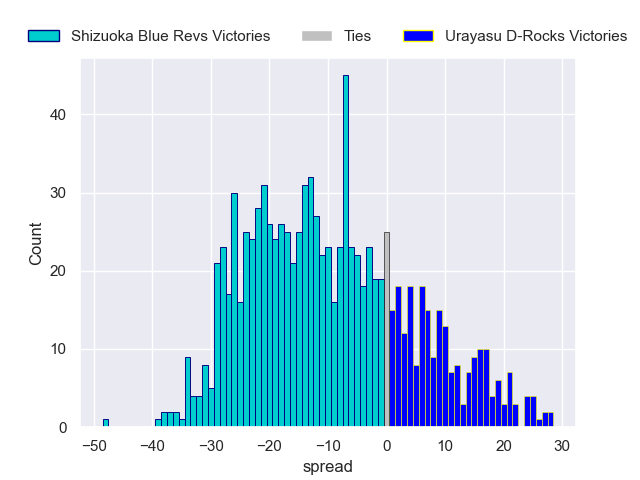

---  
layout: page  
title: Shizuoka Blue Revs V Urayasu D-Rocks on 2025/12/27  
date: 2025-12-27  
categories: "Japan Rugby League One 25/26" match projection  
---
# Shizuoka Blue Revs V Urayasu D-Rocks on 2025/12/27, 21.0 to 34.0

# Club Level Predictions

Now that the game has been played, lets see how the club predictions did. I predicted Shizuoka Blue Revs to win by 9.29, and Urayasu D-Rocks won by 13.0. That's an absolute error of 22.3 for the margin of victory, while my average absolute error has been 13.8 over the past six months. This prediction was more accurate than 20.5% of my recent predictions.

For the Over/Under model, I predicted a total of 60.5 and we have an actual total of 55.0. That's an absolute error of 5.5 compared to a six month average of 12.8. This prediction was more accurate than 71.8% of my recent predictions.
## Projected Performances - Club Model

## Projected Spreads - Club Model

## Projected Results - Club Model

