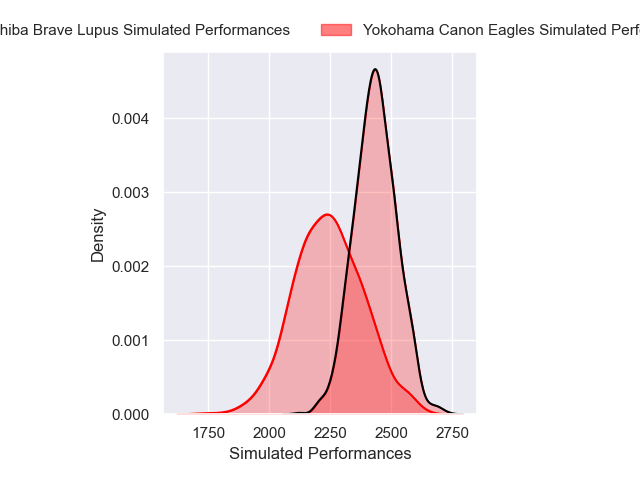
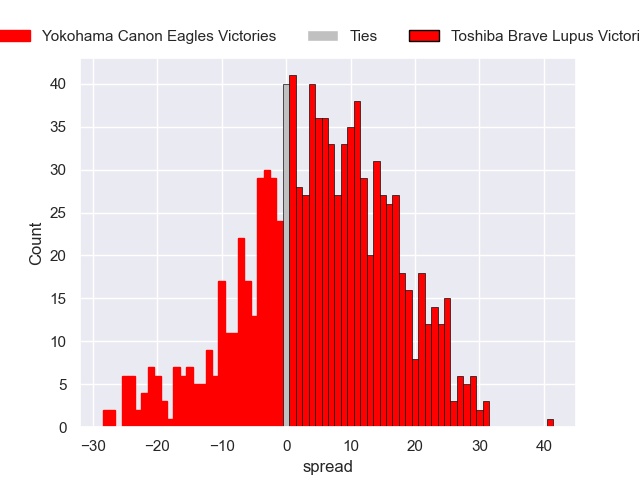
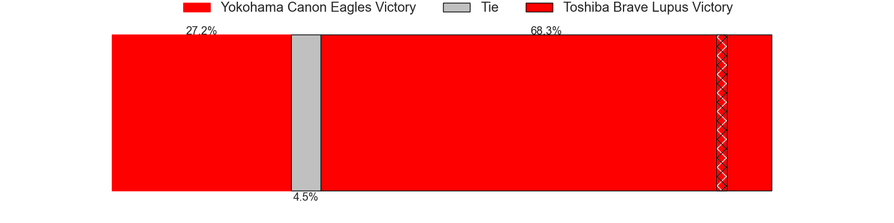

---  
layout: page  
title: Yokohama Canon Eagles V Toshiba Brave Lupus on 2025/12/27  
date: 2025-12-27  
categories: "Japan Rugby League One 25/26" match projection  
---
# Yokohama Canon Eagles V Toshiba Brave Lupus on 2025/12/27, 19.0 to 41.0

# Club Level Predictions

Now that the game has been played, lets see how the club predictions did. I predicted Toshiba Brave Lupus to win by 5.56, and Toshiba Brave Lupus won by 22.0. That's an absolute error of 16.4 for the margin of victory, while my average absolute error has been 13.8 over the past six months. This prediction was more accurate than 31.1% of my recent predictions.

For the Over/Under model, I predicted a total of 57.5 and we have an actual total of 60.0. That's an absolute error of 2.5 compared to a six month average of 12.8. This prediction was more accurate than 86.8% of my recent predictions.
## Projected Performances - Club Model

## Projected Spreads - Club Model

## Projected Results - Club Model

