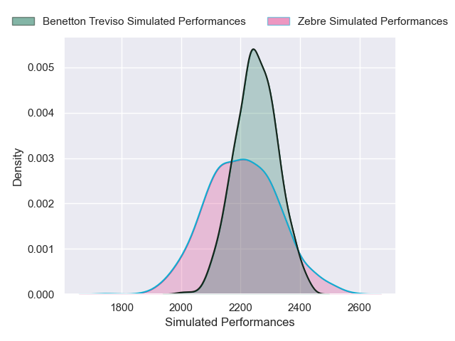
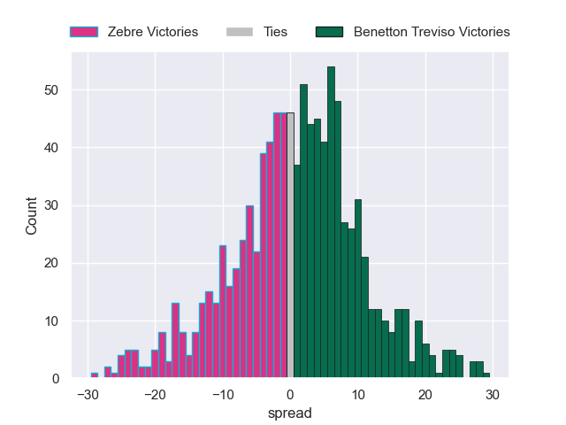

---  
layout: page  
title: Zebre V Benetton Treviso on 2025/12/27  
date: 2025-12-27  
categories: "United Rugby Championship 25/26" match projection  
---
# Zebre V Benetton Treviso on 2025/12/27, 23.0 to 37.0

# Club Level Predictions

Now that the game has been played, lets see how the club predictions did. I predicted Benetton Treviso to win by 1.21, and Benetton Treviso won by 14.0. That's an absolute error of 12.8 for the margin of victory, while my average absolute error has been 13.8 over the past six months. This prediction was more accurate than 40.6% of my recent predictions.

For the Over/Under model, I predicted a total of 49.5 and we have an actual total of 60.0. That's an absolute error of 10.5 compared to a six month average of 12.8. This prediction was more accurate than 48.9% of my recent predictions.
## Projected Performances - Club Model

## Projected Spreads - Club Model

## Projected Results - Club Model

