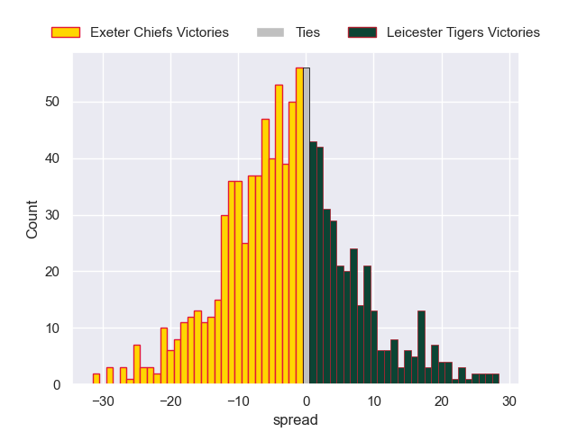

---  
layout: page  
title: Exeter Chiefs V Leicester Tigers on 2025/12/28  
date: 2025-12-28  
categories: "Gallagher Premiership 25/26" match projection  
---
# Exeter Chiefs V Leicester Tigers on 2025/12/28, 24.0 to 10.0

# Club Level Predictions

Now that the game has been played, lets see how the club predictions did. I predicted Exeter Chiefs to win by 2.04, and Exeter Chiefs won by 14.0. That's an absolute error of 12.0 for the margin of victory, while my average absolute error has been 13.8 over the past six months. This prediction was more accurate than 43.7% of my recent predictions.

For the Over/Under model, I predicted a total of 50.5 and we have an actual total of 34.0. That's an absolute error of 16.5 compared to a six month average of 12.8. This prediction was more accurate than 28.5% of my recent predictions.
## Projected Performances - Club Model

## Projected Spreads - Club Model

## Projected Results - Club Model

