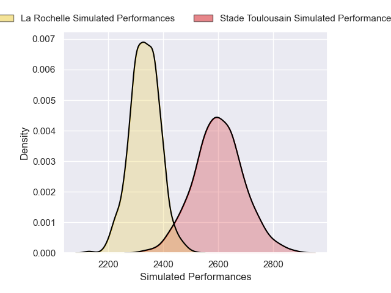
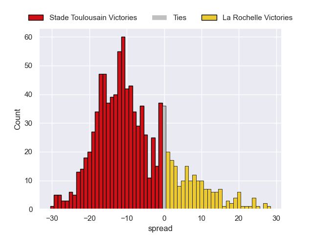
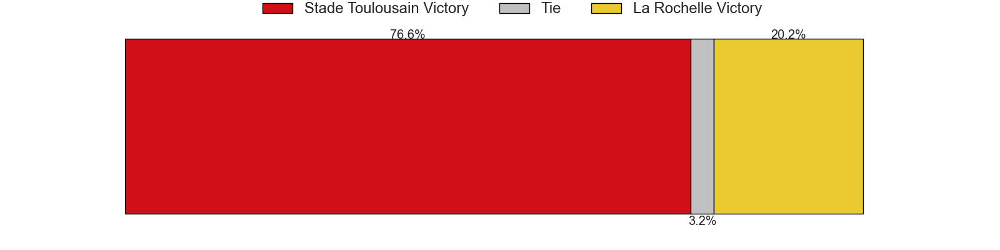

---  
layout: page  
title: Stade Toulousain V La Rochelle on 2025/12/28  
date: 2025-12-28  
categories: "Top 14 25/26" match projection  
---
# Stade Toulousain V La Rochelle on 2025/12/28, 60.0 to 14.0

# Club Level Predictions

Now that the game has been played, lets see how the club predictions did. I predicted Stade Toulousain to win by 8.13, and Stade Toulousain won by 46.0. That's an absolute error of 37.9 for the margin of victory, while my average absolute error has been 13.8 over the past six months. This prediction was more accurate than 5.4% of my recent predictions.

For the Over/Under model, I predicted a total of 51.5 and we have an actual total of 74.0. That's an absolute error of 22.5 compared to a six month average of 12.8. This prediction was more accurate than 16.8% of my recent predictions.
## Projected Performances - Club Model

## Projected Spreads - Club Model

## Projected Results - Club Model

