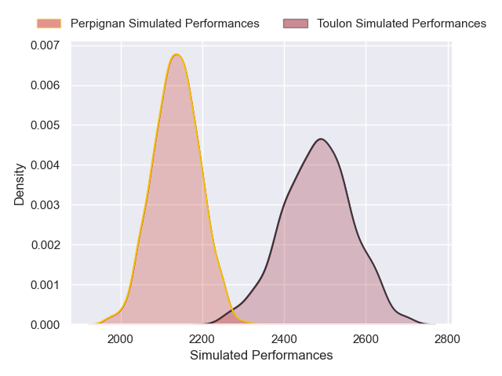
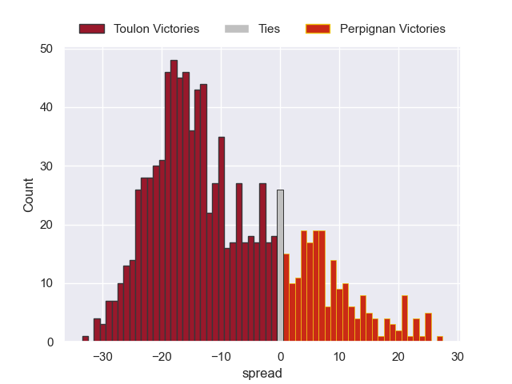

---  
layout: page  
title: Toulon V Perpignan on 2025/12/28  
date: 2025-12-28  
categories: "Top 14 25/26" match projection  
---
# Toulon V Perpignan on 2025/12/28, 31.0 to 16.0

# Club Level Predictions

Now that the game has been played, lets see how the club predictions did. I predicted Toulon to win by 10.13, and Toulon won by 15.0. That's an absolute error of 4.9 for the margin of victory, while my average absolute error has been 13.8 over the past six months. This prediction was more accurate than 75.9% of my recent predictions.

For the Over/Under model, I predicted a total of 52.5 and we have an actual total of 47.0. That's an absolute error of 5.5 compared to a six month average of 12.8. This prediction was more accurate than 71.8% of my recent predictions.
## Projected Performances - Club Model

## Projected Spreads - Club Model

## Projected Results - Club Model

