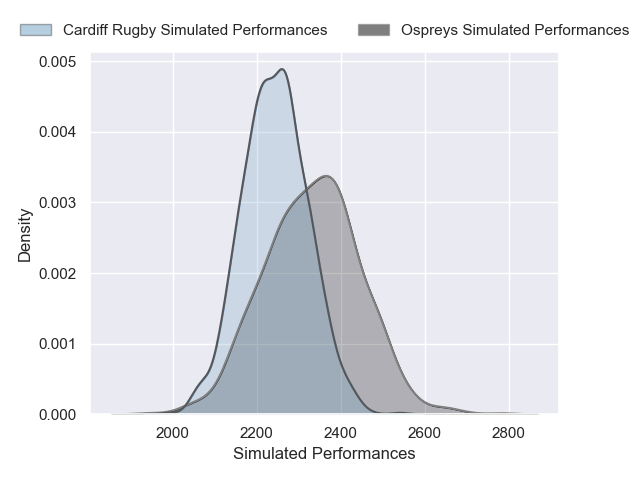
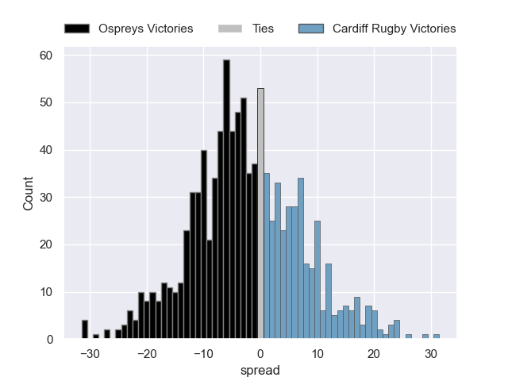

---  
layout: page  
title: Ospreys V Cardiff Rugby on 2026/01/01  
date: 2026-01-01  
categories: "United Rugby Championship 25/26" match projection  
---
# Ospreys V Cardiff Rugby on 2026/01/01, 33.0 to 22.0

# Club Level Predictions

Now that the game has been played, lets see how the club predictions did. I predicted Ospreys to win by 3.36, and Ospreys won by 11.0. That's an absolute error of 7.6 for the margin of victory, while my average absolute error has been 13.8 over the past six months. This prediction was more accurate than 61.5% of my recent predictions.

For the Over/Under model, I predicted a total of 46.5 and we have an actual total of 55.0. That's an absolute error of 8.5 compared to a six month average of 12.8. This prediction was more accurate than 59.1% of my recent predictions.
## Projected Performances - Club Model

## Projected Spreads - Club Model

## Projected Results - Club Model

