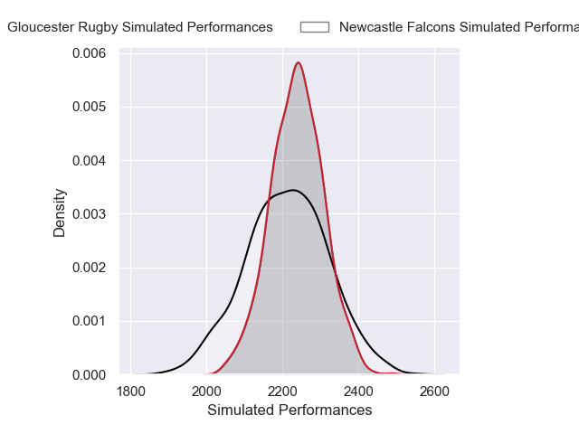
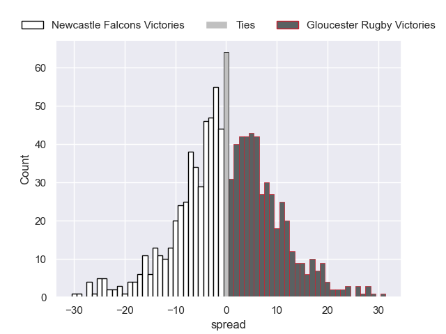

# Newcastle Falcons V Gloucester Rugby on 2026/01/02, 25.0 to 19.0

# Club Level Predictions

Now that the game has been played, lets see how the club predictions did. I predicted Gloucester Rugby to win by 0.43, and Newcastle Falcons won by 6.0. That's an absolute error of 6.4 for the margin of victory, while my average absolute error has been 13.8 over the past six months. This prediction was more accurate than 66.9% of my recent predictions.

For the Over/Under model, I predicted a total of 52.5 and we have an actual total of 44.0. That's an absolute error of 8.5 compared to a six month average of 12.5. This prediction was more accurate than 57.6% of my recent predictions.
## Projected Performances - Club Model

## Projected Spreads - Club Model

## Projected Results - Club Model

