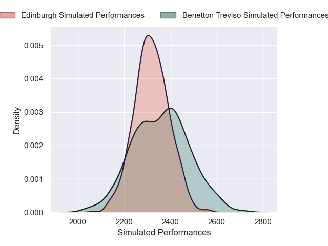
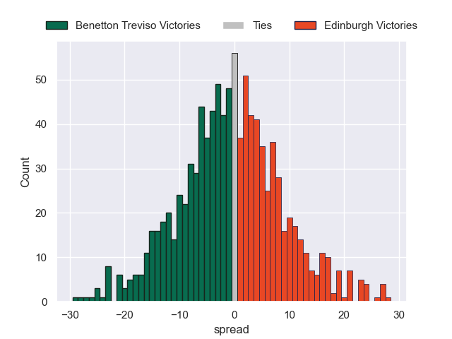

# Benetton Treviso V Edinburgh on 2026/01/03, 14.0 to 15.0

# Club Level Predictions

Now that the game has been played, lets see how the club predictions did. I predicted Benetton Treviso to win by 2.72, and Edinburgh won by 1.0. That's an absolute error of 3.7 for the margin of victory, while my average absolute error has been 13.8 over the past six months. This prediction was more accurate than 81.5% of my recent predictions.

For the Over/Under model, I predicted a total of 44.5 and we have an actual total of 29.0. That's an absolute error of 15.5 compared to a six month average of 12.5. This prediction was more accurate than 31.1% of my recent predictions.
## Projected Performances - Club Model

## Projected Spreads - Club Model

## Projected Results - Club Model

