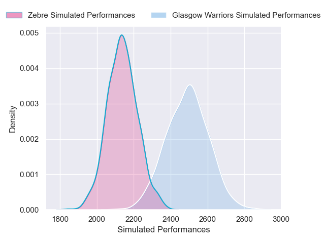
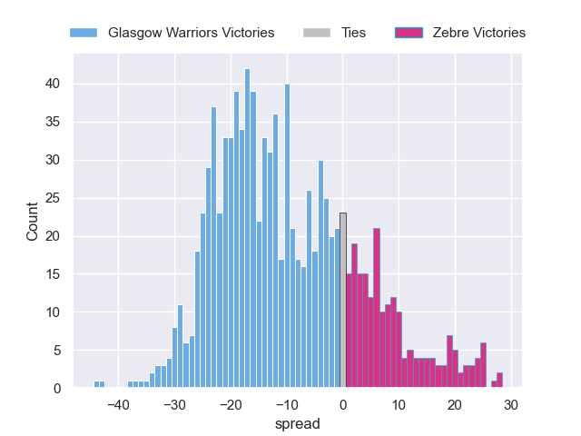

# Glasgow Warriors V Zebre on 2026/01/03, 47.0 to 10.0

# Club Level Predictions

Now that the game has been played, lets see how the club predictions did. I predicted Glasgow Warriors to win by 10.85, and Glasgow Warriors won by 37.0. That's an absolute error of 26.2 for the margin of victory, while my average absolute error has been 13.8 over the past six months. This prediction was more accurate than 14.8% of my recent predictions.

For the Over/Under model, I predicted a total of 47.5 and we have an actual total of 57.0. That's an absolute error of 9.5 compared to a six month average of 12.5. This prediction was more accurate than 53.2% of my recent predictions.
## Projected Performances - Club Model

## Projected Spreads - Club Model

## Projected Results - Club Model

