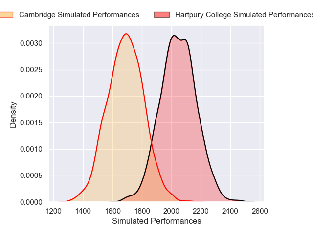
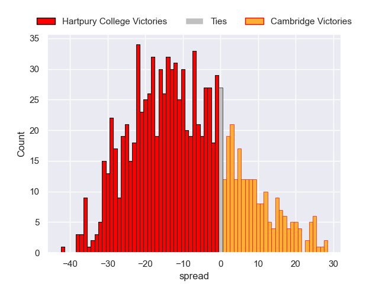

# Hartpury College V Cambridge on 2026/01/03, 42.0 to 22.0

# Club Level Predictions

Now that the game has been played, lets see how the club predictions did. I predicted Hartpury College to win by 12.74, and Hartpury College won by 20.0. That's an absolute error of 7.3 for the margin of victory, while my average absolute error has been 13.8 over the past six months. This prediction was more accurate than 63.1% of my recent predictions.

For the Over/Under model, I predicted a total of 69.5 and we have an actual total of 64.0. That's an absolute error of 5.5 compared to a six month average of 12.5. This prediction was more accurate than 71.6% of my recent predictions.
## Projected Performances - Club Model

## Projected Spreads - Club Model

## Projected Results - Club Model

