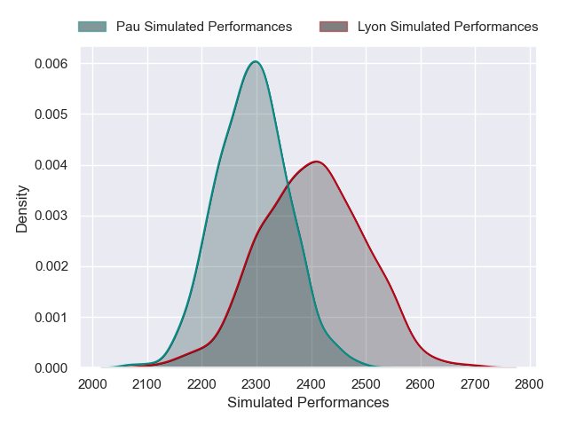
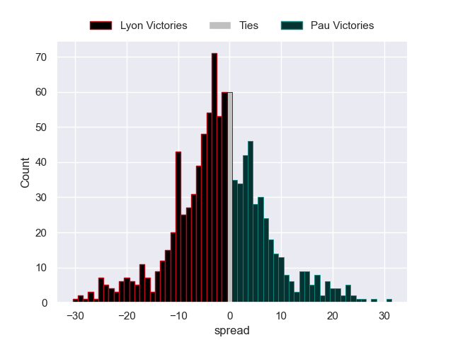

# Lyon V Pau on 2026/01/03, 22.0 to 17.0

# Club Level Predictions

Now that the game has been played, lets see how the club predictions did. I predicted Lyon to win by 0.7, and Lyon won by 5.0. That's an absolute error of 4.3 for the margin of victory, while my average absolute error has been 13.8 over the past six months. This prediction was more accurate than 78.0% of my recent predictions.

For the Over/Under model, I predicted a total of 55.5 and we have an actual total of 39.0. That's an absolute error of 16.5 compared to a six month average of 12.5. This prediction was more accurate than 28.1% of my recent predictions.
## Projected Performances - Club Model

## Projected Spreads - Club Model

## Projected Results - Club Model

