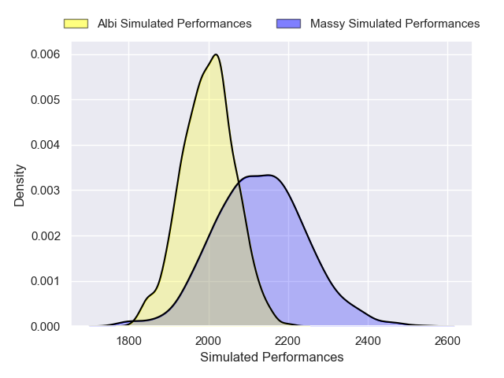
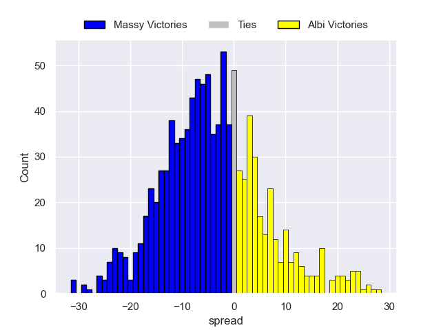
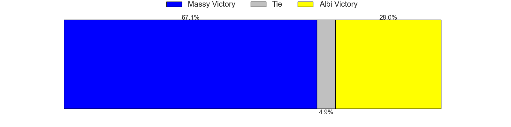

# Massy V Albi on 2026/01/09, 28.0 to 6.0

# Club Level Predictions

Now that the game has been played, lets see how the club predictions did. I predicted Massy to win by 3.08, and Massy won by 22.0. That's an absolute error of 18.9 for the margin of victory, while my average absolute error has been 13.6 over the past six months. This prediction was more accurate than 25.8% of my recent predictions.

For the Over/Under model, I predicted a total of 42.5 and we have an actual total of 34.0. That's an absolute error of 8.5 compared to a six month average of 12.7. This prediction was more accurate than 57.7% of my recent predictions.
## Projected Performances - Club Model

## Projected Spreads - Club Model

## Projected Results - Club Model

