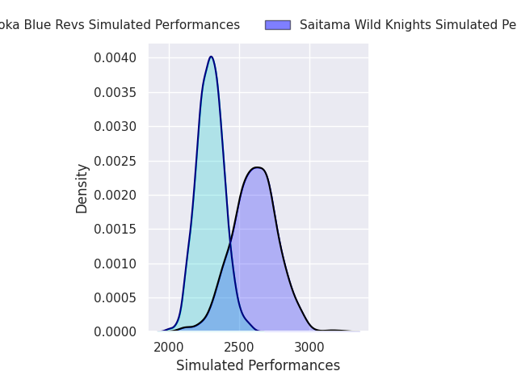
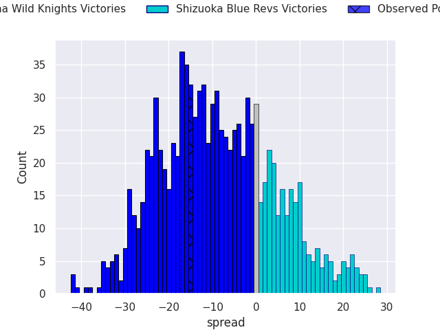
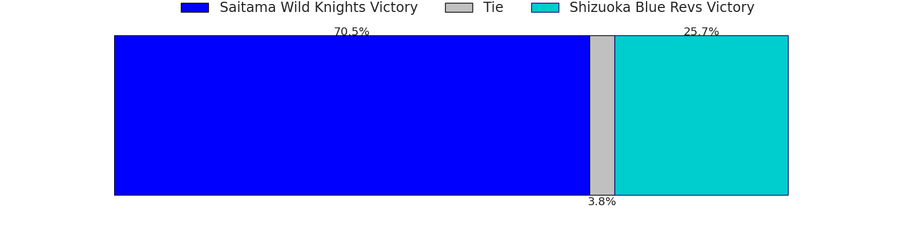

# Saitama Wild Knights V Shizuoka Blue Revs on 2026/01/09, 37.0 to 22.0

# Club Level Predictions

Now that the game has been played, lets see how the club predictions did. I predicted Saitama Wild Knights to win by 8.83, and Saitama Wild Knights won by 15.0. That's an absolute error of 6.2 for the margin of victory, while my average absolute error has been 13.6 over the past six months. This prediction was more accurate than 67.4% of my recent predictions.

For the Over/Under model, I predicted a total of 55.5 and we have an actual total of 59.0. That's an absolute error of 3.5 compared to a six month average of 12.7. This prediction was more accurate than 83.5% of my recent predictions.
## Projected Performances - Club Model

## Projected Spreads - Club Model

## Projected Results - Club Model

