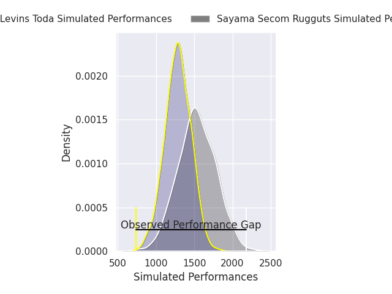
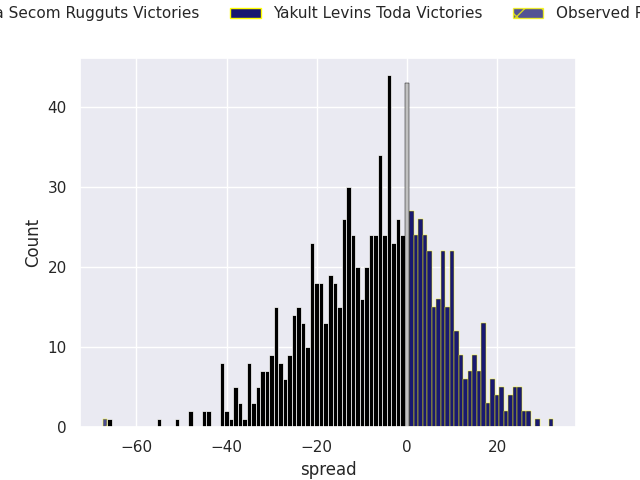
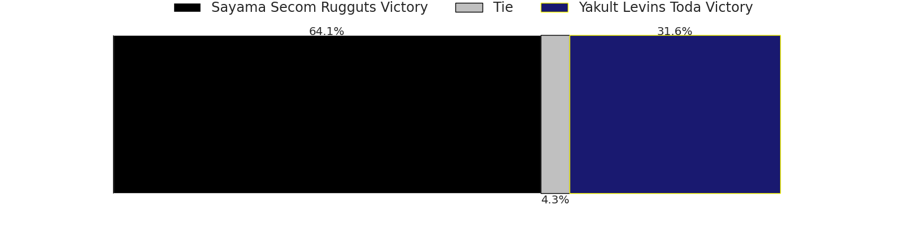

# Sayama Secom Rugguts V Yakult Levins Toda on 2026/01/09, 70.0 to 3.0

# Club Level Predictions

Now that the game has been played, lets see how the club predictions did. I predicted Sayama Secom Rugguts to win by 6.76, and Sayama Secom Rugguts won by 67.0. That's an absolute error of 60.2 for the margin of victory, while my average absolute error has been 13.6 over the past six months. This prediction was more accurate than 0.3% of my recent predictions.

For the Over/Under model, I predicted a total of 52.5 and we have an actual total of 73.0. That's an absolute error of 20.5 compared to a six month average of 12.7. This prediction was more accurate than 19.3% of my recent predictions.
## Projected Performances - Club Model

## Projected Spreads - Club Model

## Projected Results - Club Model

