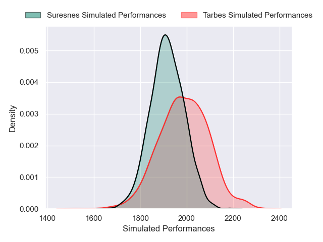

# Tarbes V Suresnes on 2026/01/09, 0.0 to 3.0

# Club Level Predictions

Now that the game has been played, lets see how the club predictions did. I predicted Tarbes to win by 2.24, and Suresnes won by 3.0. That's an absolute error of 5.2 for the margin of victory, while my average absolute error has been 13.6 over the past six months. This prediction was more accurate than 73.5% of my recent predictions.

For the Over/Under model, I predicted a total of 40.5 and we have an actual total of 3.0. That's an absolute error of 37.5 compared to a six month average of 12.7. This prediction was more accurate than 2.6% of my recent predictions.
## Projected Performances - Club Model

## Projected Spreads - Club Model

## Projected Results - Club Model

