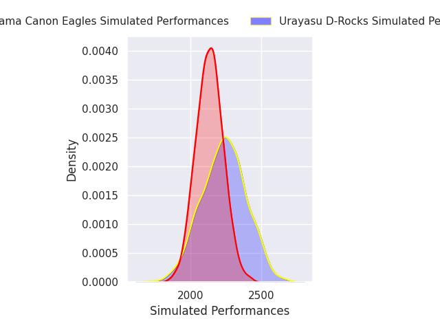
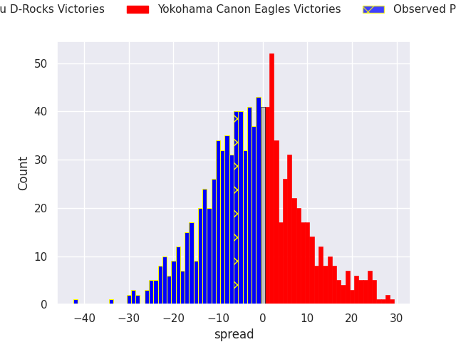
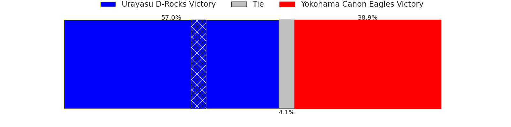

# Urayasu D-Rocks V Yokohama Canon Eagles on 2026/01/09, 28.0 to 22.0

# Club Level Predictions

Now that the game has been played, lets see how the club predictions did. I predicted Urayasu D-Rocks to win by 2.18, and Urayasu D-Rocks won by 6.0. That's an absolute error of 3.8 for the margin of victory, while my average absolute error has been 13.6 over the past six months. This prediction was more accurate than 80.1% of my recent predictions.

For the Over/Under model, I predicted a total of 55.5 and we have an actual total of 50.0. That's an absolute error of 5.5 compared to a six month average of 12.7. This prediction was more accurate than 72.1% of my recent predictions.
## Projected Performances - Club Model

## Projected Spreads - Club Model

## Projected Results - Club Model

