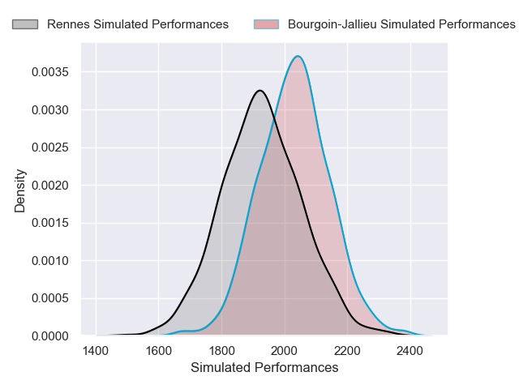

# Bourgoin-Jallieu V Rennes on 2026/01/10, 15.0 to 9.0

# Club Level Predictions

Now that the game has been played, lets see how the club predictions did. I predicted Bourgoin-Jallieu to win by 4.24, and Bourgoin-Jallieu won by 6.0. That's an absolute error of 1.8 for the margin of victory, while my average absolute error has been 13.6 over the past six months. This prediction was more accurate than 90.3% of my recent predictions.

For the Over/Under model, I predicted a total of 35.5 and we have an actual total of 24.0. That's an absolute error of 11.5 compared to a six month average of 12.7. This prediction was more accurate than 46.1% of my recent predictions.
## Projected Performances - Club Model

## Projected Spreads - Club Model

## Projected Results - Club Model

