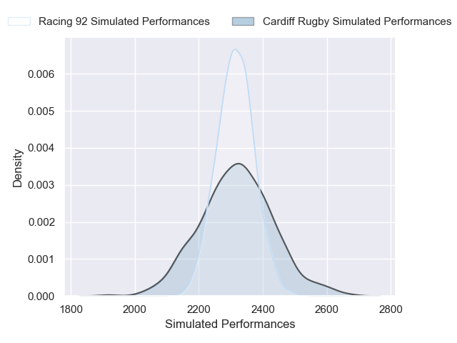
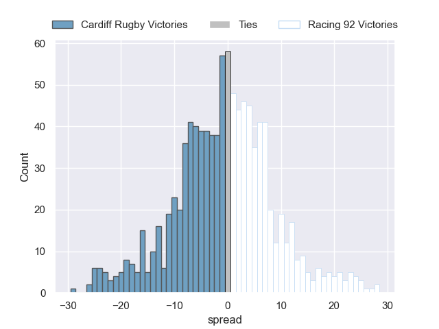

# Cardiff Rugby V Racing 92 on 2026/01/10, 32.0 to 13.0

# Club Level Predictions

Now that the game has been played, lets see how the club predictions did. I predicted Cardiff Rugby to win by 0.8, and Cardiff Rugby won by 19.0. That's an absolute error of 18.2 for the margin of victory, while my average absolute error has been 13.6 over the past six months. This prediction was more accurate than 27.2% of my recent predictions.

For the Over/Under model, I predicted a total of 57.5 and we have an actual total of 45.0. That's an absolute error of 12.5 compared to a six month average of 12.7. This prediction was more accurate than 42.6% of my recent predictions.
## Projected Performances - Club Model

## Projected Spreads - Club Model

## Projected Results - Club Model

