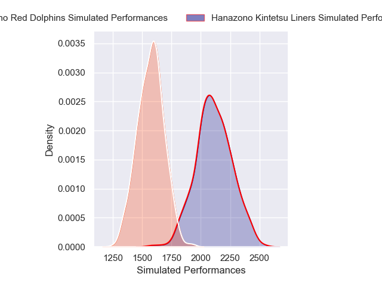
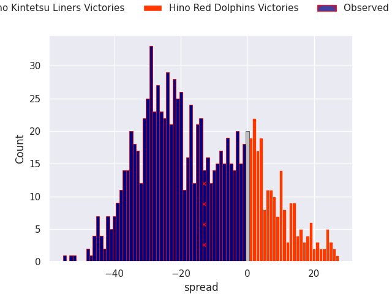
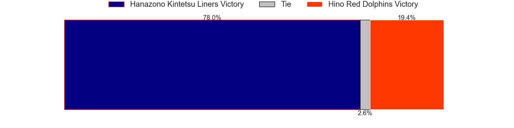

# Hanazono Kintetsu Liners V Hino Red Dolphins on 2026/01/10, 47.0 to 34.0

# Club Level Predictions

Now that the game has been played, lets see how the club predictions did. I predicted Hanazono Kintetsu Liners to win by 14.87, and Hanazono Kintetsu Liners won by 13.0. That's an absolute error of 1.9 for the margin of victory, while my average absolute error has been 13.6 over the past six months. This prediction was more accurate than 89.9% of my recent predictions.

For the Over/Under model, I predicted a total of 54.5 and we have an actual total of 81.0. That's an absolute error of 26.5 compared to a six month average of 12.7. This prediction was more accurate than 10.0% of my recent predictions.
## Projected Performances - Club Model

## Projected Spreads - Club Model

## Projected Results - Club Model

