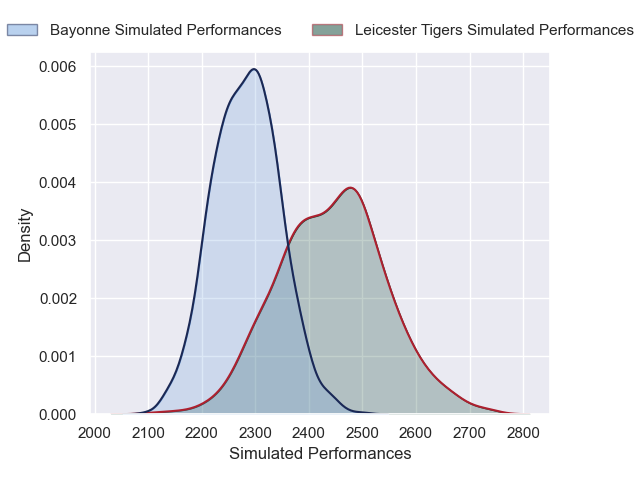
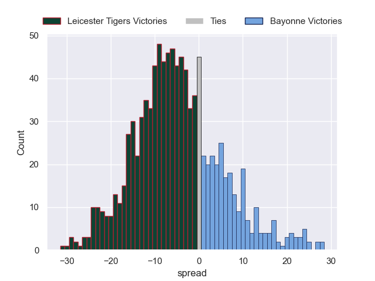

# Leicester Tigers V Bayonne on 2026/01/10, 57.0 to 14.0

# Club Level Predictions

Now that the game has been played, lets see how the club predictions did. I predicted Leicester Tigers to win by 5.29, and Leicester Tigers won by 43.0. That's an absolute error of 37.7 for the margin of victory, while my average absolute error has been 13.6 over the past six months. This prediction was more accurate than 5.0% of my recent predictions.

For the Over/Under model, I predicted a total of 59.5 and we have an actual total of 71.0. That's an absolute error of 11.5 compared to a six month average of 12.7. This prediction was more accurate than 46.1% of my recent predictions.
## Projected Performances - Club Model

## Projected Spreads - Club Model

## Projected Results - Club Model

