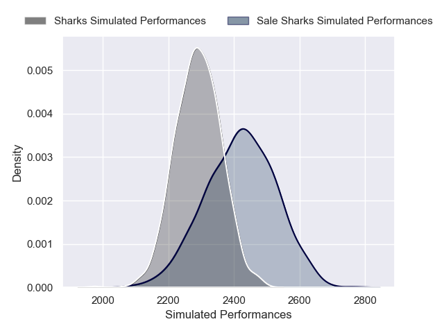
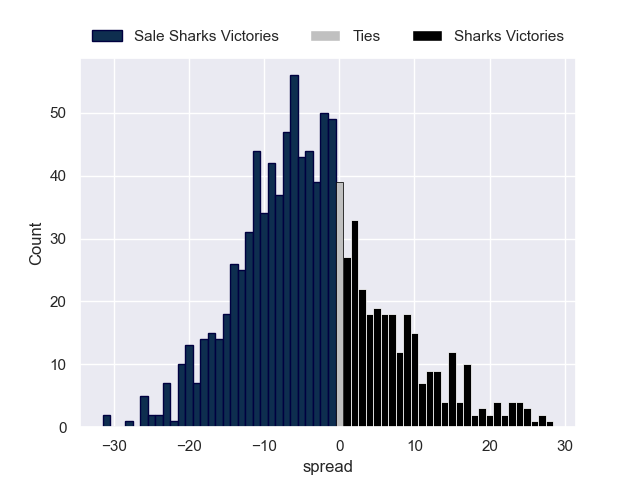

# Sale Sharks V Sharks on 2026/01/10, 26.0 to 10.0

# Club Level Predictions

Now that the game has been played, lets see how the club predictions did. I predicted Sale Sharks to win by 4.18, and Sale Sharks won by 16.0. That's an absolute error of 11.8 for the margin of victory, while my average absolute error has been 13.6 over the past six months. This prediction was more accurate than 43.3% of my recent predictions.

For the Over/Under model, I predicted a total of 48.5 and we have an actual total of 36.0. That's an absolute error of 12.5 compared to a six month average of 12.7. This prediction was more accurate than 42.6% of my recent predictions.
## Projected Performances - Club Model

## Projected Spreads - Club Model

## Projected Results - Club Model

