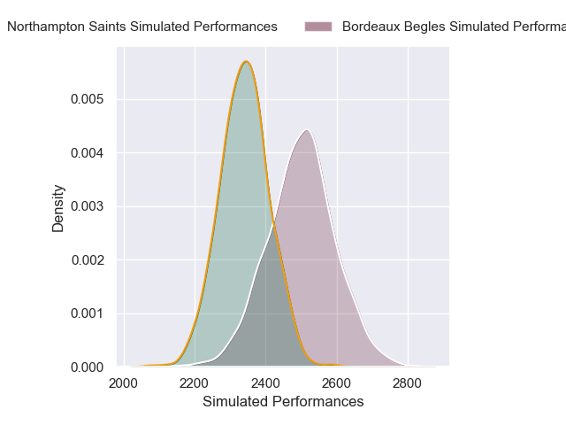

# Bordeaux Begles V Northampton Saints on 2026/01/11, 50.0 to 28.0

# Club Level Predictions

Now that the game has been played, lets see how the club predictions did. I predicted Bordeaux Begles to win by 4.47, and Bordeaux Begles won by 22.0. That's an absolute error of 17.5 for the margin of victory, while my average absolute error has been 13.6 over the past six months. This prediction was more accurate than 28.4% of my recent predictions.

For the Over/Under model, I predicted a total of 57.5 and we have an actual total of 78.0. That's an absolute error of 20.5 compared to a six month average of 12.7. This prediction was more accurate than 19.3% of my recent predictions.
## Projected Performances - Club Model

## Projected Spreads - Club Model

## Projected Results - Club Model

