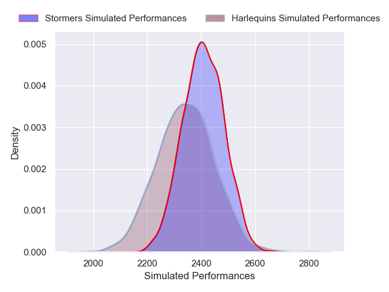
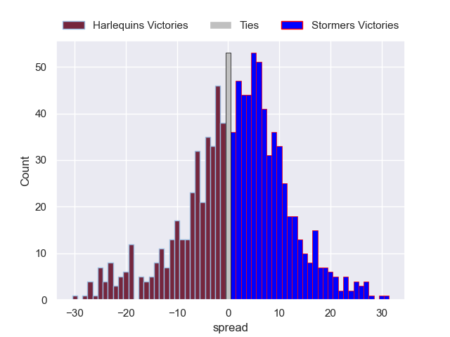

# Harlequins V Stormers on 2026/01/11, 61.0 to 10.0

# Club Level Predictions

Now that the game has been played, lets see how the club predictions did. I predicted Stormers to win by 4.09, and Harlequins won by 51.0. That's an absolute error of 55.1 for the margin of victory, while my average absolute error has been 13.6 over the past six months. This prediction was more accurate than 1.0% of my recent predictions.

For the Over/Under model, I predicted a total of 62.5 and we have an actual total of 71.0. That's an absolute error of 8.5 compared to a six month average of 12.7. This prediction was more accurate than 57.7% of my recent predictions.
## Projected Performances - Club Model

## Projected Spreads - Club Model

## Projected Results - Club Model

