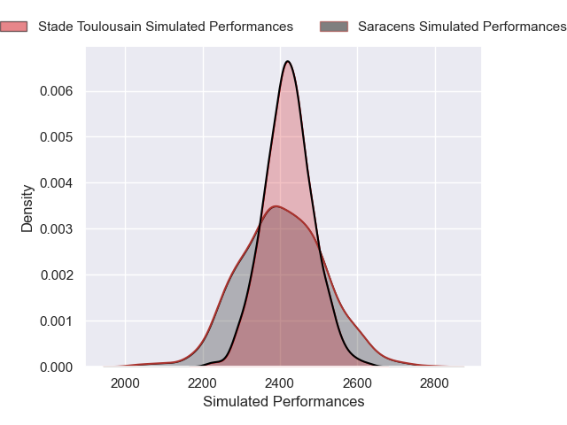
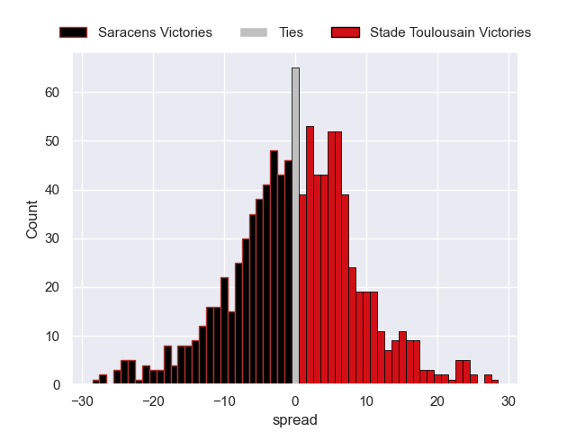

# Saracens V Stade Toulousain on 2026/01/11, 20.0 to 14.0

# Club Level Predictions

Now that the game has been played, lets see how the club predictions did. I predicted Stade Toulousain to win by 0.81, and Saracens won by 6.0. That's an absolute error of 6.8 for the margin of victory, while my average absolute error has been 13.6 over the past six months. This prediction was more accurate than 64.3% of my recent predictions.

For the Over/Under model, I predicted a total of 61.5 and we have an actual total of 34.0. That's an absolute error of 27.5 compared to a six month average of 12.7. This prediction was more accurate than 8.3% of my recent predictions.
## Projected Performances - Club Model

## Projected Spreads - Club Model

## Projected Results - Club Model

