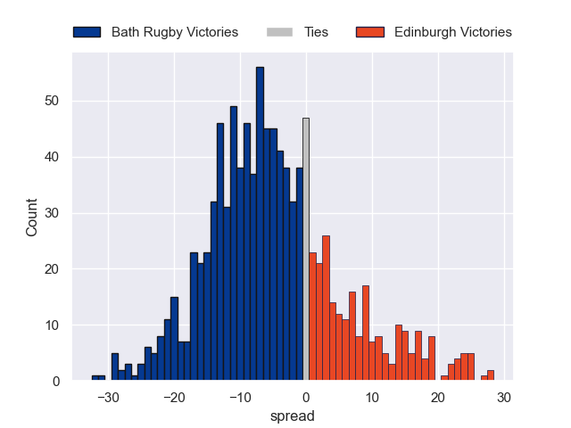

# Bath Rugby V Edinburgh on 2026/01/16, 63.0 to 10.0

# Club Level Predictions

Now that the game has been played, lets see how the club predictions did. I predicted Bath Rugby to win by 6.65, and Bath Rugby won by 53.0. That's an absolute error of 46.4 for the margin of victory, while my average absolute error has been 13.6 over the past six months. This prediction was more accurate than 2.6% of my recent predictions.

For the Over/Under model, I predicted a total of 50.5 and we have an actual total of 73.0. That's an absolute error of 22.5 compared to a six month average of 12.9. This prediction was more accurate than 16.7% of my recent predictions.
## Projected Performances - Club Model

## Projected Spreads - Club Model

## Projected Results - Club Model

