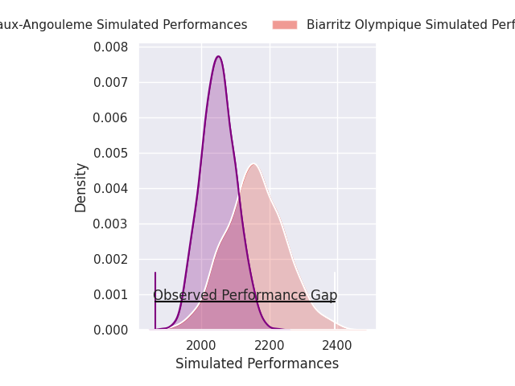
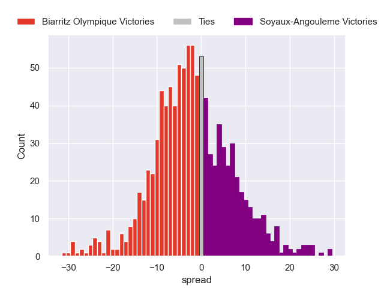
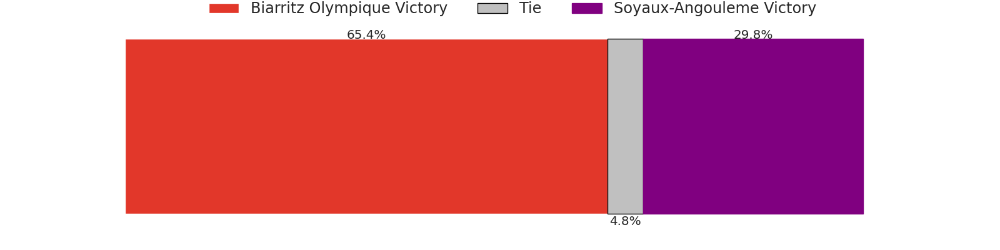

# Biarritz Olympique V Soyaux-Angouleme on 2026/01/16, 46.0 to 22.0

# Club Level Predictions

Now that the game has been played, lets see how the club predictions did. I predicted Biarritz Olympique to win by 3.42, and Biarritz Olympique won by 24.0. That's an absolute error of 20.6 for the margin of victory, while my average absolute error has been 13.6 over the past six months. This prediction was more accurate than 22.7% of my recent predictions.

For the Over/Under model, I predicted a total of 49.5 and we have an actual total of 68.0. That's an absolute error of 18.5 compared to a six month average of 12.9. This prediction was more accurate than 24.9% of my recent predictions.
## Projected Performances - Club Model

## Projected Spreads - Club Model

## Projected Results - Club Model

