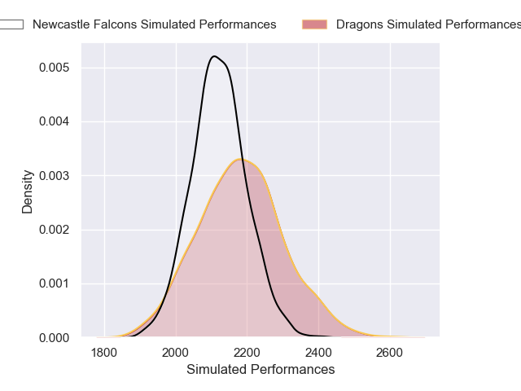

# Dragons V Newcastle Falcons on 2026/01/16, 35.0 to 12.0

# Club Level Predictions

Now that the game has been played, lets see how the club predictions did. I predicted Dragons to win by 1.75, and Dragons won by 23.0. That's an absolute error of 21.2 for the margin of victory, while my average absolute error has been 13.6 over the past six months. This prediction was more accurate than 21.3% of my recent predictions.

For the Over/Under model, I predicted a total of 52.5 and we have an actual total of 47.0. That's an absolute error of 5.5 compared to a six month average of 12.9. This prediction was more accurate than 73.4% of my recent predictions.
## Projected Performances - Club Model

## Projected Spreads - Club Model

## Projected Results - Club Model

