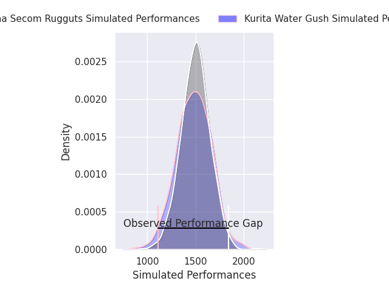
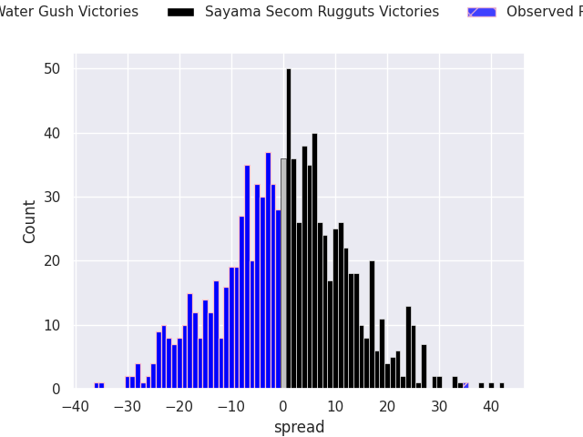
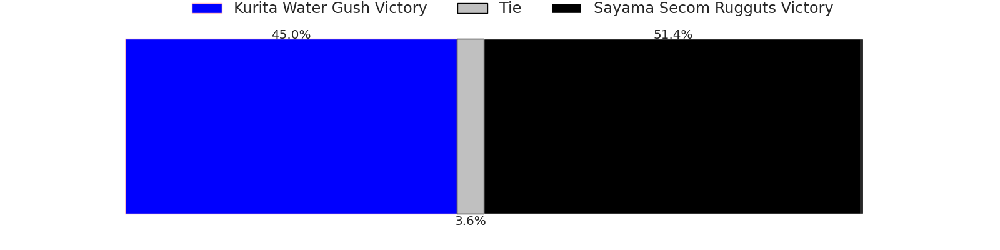

# Kurita Water Gush V Sayama Secom Rugguts on 2026/01/16, 24.0 to 59.0

# Club Level Predictions

Now that the game has been played, lets see how the club predictions did. I predicted Sayama Secom Rugguts to win by 0.5, and Sayama Secom Rugguts won by 35.0. That's an absolute error of 34.5 for the margin of victory, while my average absolute error has been 13.6 over the past six months. This prediction was more accurate than 6.6% of my recent predictions.

For the Over/Under model, I predicted a total of 57.5 and we have an actual total of 83.0. That's an absolute error of 25.5 compared to a six month average of 12.9. This prediction was more accurate than 12.0% of my recent predictions.
## Projected Performances - Club Model

## Projected Spreads - Club Model

## Projected Results - Club Model

