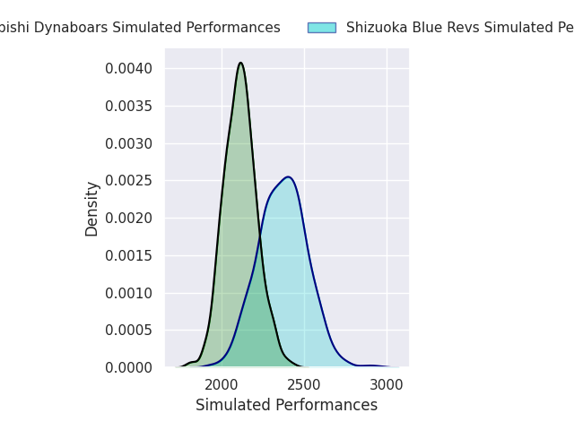
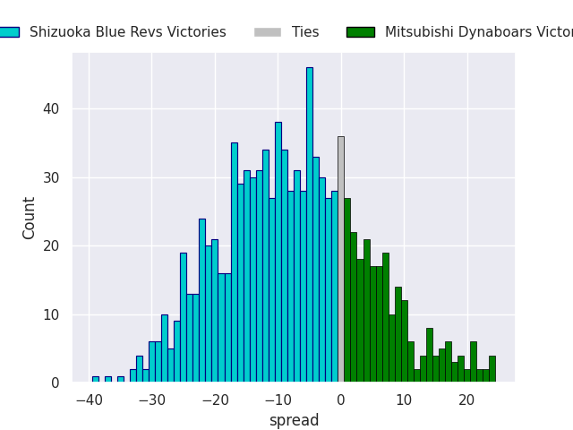
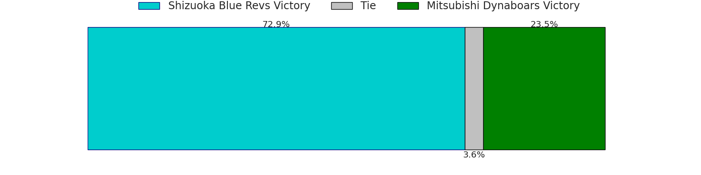

# Shizuoka Blue Revs V Mitsubishi Dynaboars on 2026/01/16, 47.0 to 36.0

# Club Level Predictions

Now that the game has been played, lets see how the club predictions did. I predicted Shizuoka Blue Revs to win by 6.86, and Shizuoka Blue Revs won by 11.0. That's an absolute error of 4.1 for the margin of victory, while my average absolute error has been 13.6 over the past six months. This prediction was more accurate than 78.4% of my recent predictions.

For the Over/Under model, I predicted a total of 54.5 and we have an actual total of 83.0. That's an absolute error of 28.5 compared to a six month average of 12.9. This prediction was more accurate than 8.2% of my recent predictions.
## Projected Performances - Club Model

## Projected Spreads - Club Model

## Projected Results - Club Model

