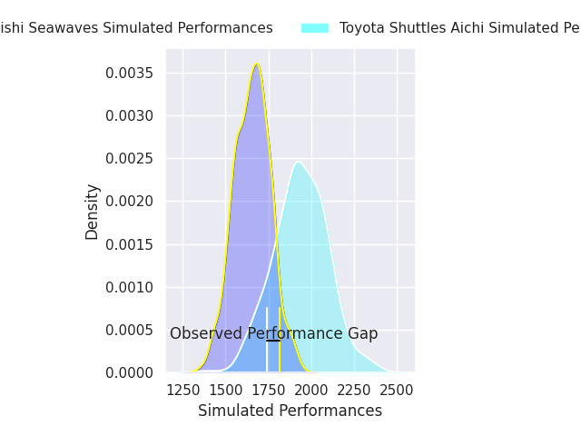
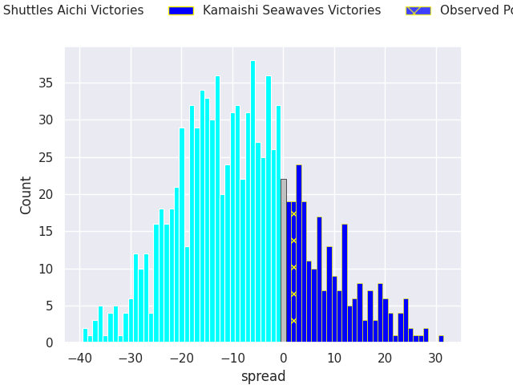
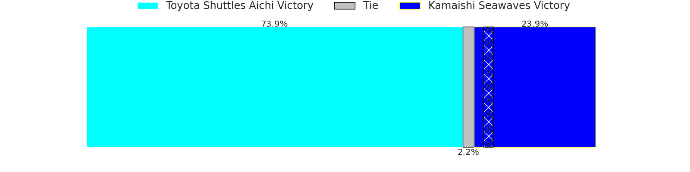

# Toyota Shuttles Aichi V Kamaishi Seawaves on 2026/01/16, 52.0 to 54.0

# Club Level Predictions

Now that the game has been played, lets see how the club predictions did. I predicted Toyota Shuttles Aichi to win by 7.88, and Kamaishi Seawaves won by 2.0. That's an absolute error of 9.9 for the margin of victory, while my average absolute error has been 13.6 over the past six months. This prediction was more accurate than 49.3% of my recent predictions.

For the Over/Under model, I predicted a total of 57.5 and we have an actual total of 106.0. That's an absolute error of 48.5 compared to a six month average of 12.9. This prediction was more accurate than 0.4% of my recent predictions.
## Projected Performances - Club Model

## Projected Spreads - Club Model

## Projected Results - Club Model

