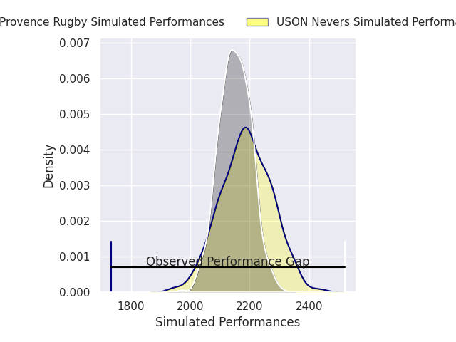
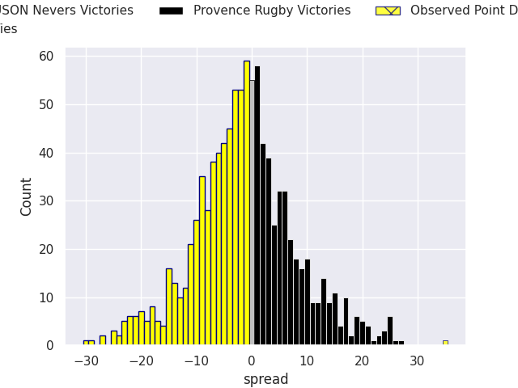

# USON Nevers V Provence Rugby on 2026/01/16, 10.0 to 45.0

# Club Level Predictions

Now that the game has been played, lets see how the club predictions did. I predicted USON Nevers to win by 1.16, and Provence Rugby won by 35.0. That's an absolute error of 36.2 for the margin of victory, while my average absolute error has been 13.6 over the past six months. This prediction was more accurate than 5.6% of my recent predictions.

For the Over/Under model, I predicted a total of 49.5 and we have an actual total of 55.0. That's an absolute error of 5.5 compared to a six month average of 12.9. This prediction was more accurate than 73.4% of my recent predictions.
## Projected Performances - Club Model

## Projected Spreads - Club Model

## Projected Results - Club Model

