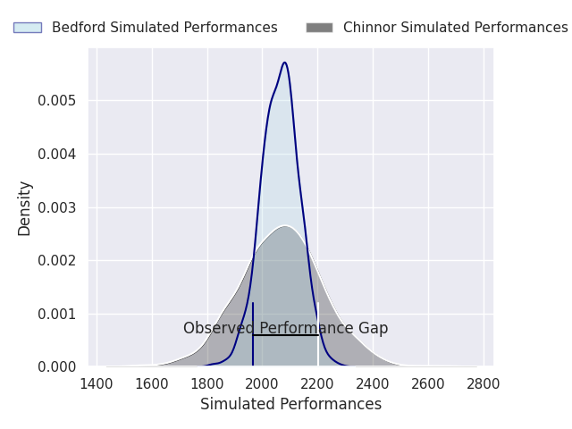
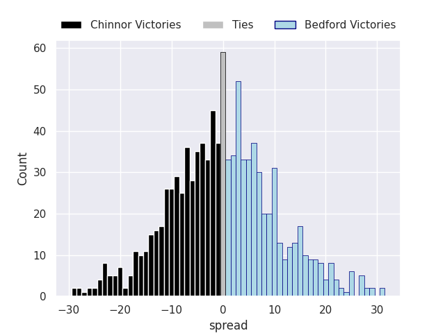

# Chinnor V Bedford on 2026/01/17, 27.0 to 17.0

# Club Level Predictions

Now that the game has been played, lets see how the club predictions did. I predicted Bedford to win by 0.49, and Chinnor won by 10.0. That's an absolute error of 10.5 for the margin of victory, while my average absolute error has been 13.6 over the past six months. This prediction was more accurate than 47.6% of my recent predictions.

For the Over/Under model, I predicted a total of 49.5 and we have an actual total of 44.0. That's an absolute error of 5.5 compared to a six month average of 12.9. This prediction was more accurate than 73.4% of my recent predictions.
## Projected Performances - Club Model

## Projected Spreads - Club Model

## Projected Results - Club Model

