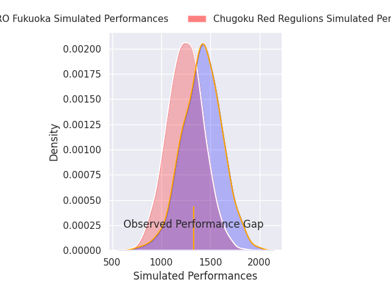
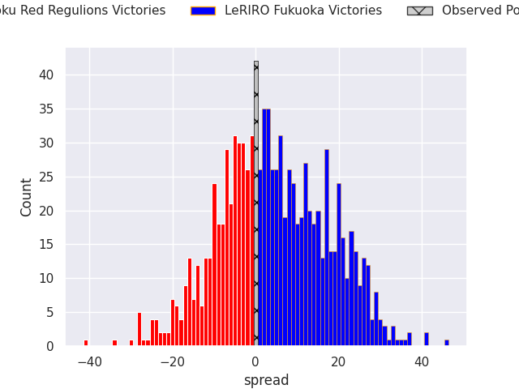
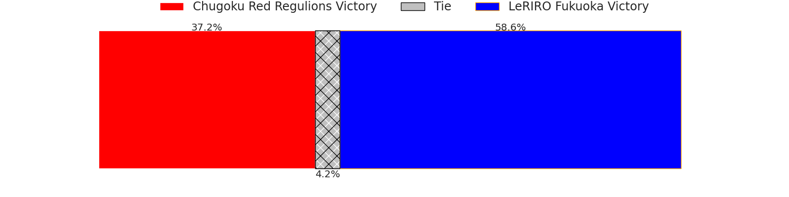

# Chugoku Red Regulions V LeRIRO Fukuoka on 2026/01/17, 45.0 to 45.0

# Club Level Predictions

Now that the game has been played, lets see how the club predictions did. I predicted LeRIRO Fukuoka to win by 4.28, and LeRIRO Fukuoka won by 0.0. That's an absolute error of 4.3 for the margin of victory, while my average absolute error has been 13.6 over the past six months. This prediction was more accurate than 77.3% of my recent predictions.

For the Over/Under model, I predicted a total of 59.5 and we have an actual total of 90.0. That's an absolute error of 30.5 compared to a six month average of 12.9. This prediction was more accurate than 6.2% of my recent predictions.
## Projected Performances - Club Model

## Projected Spreads - Club Model

## Projected Results - Club Model

