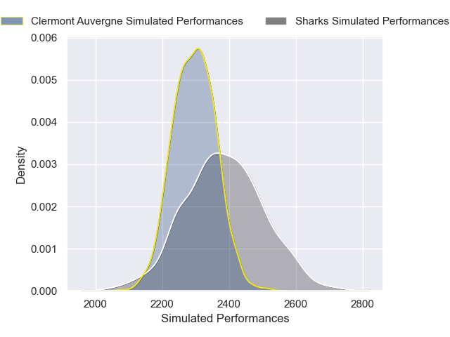
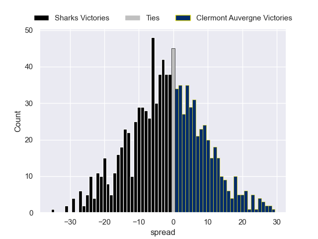

# Sharks V Clermont Auvergne on 2026/01/17, 50.0 to 12.0

# Club Level Predictions

Now that the game has been played, lets see how the club predictions did. I predicted Sharks to win by 2.1, and Sharks won by 38.0. That's an absolute error of 35.9 for the margin of victory, while my average absolute error has been 13.6 over the past six months. This prediction was more accurate than 5.8% of my recent predictions.

For the Over/Under model, I predicted a total of 52.5 and we have an actual total of 62.0. That's an absolute error of 9.5 compared to a six month average of 12.9. This prediction was more accurate than 53.4% of my recent predictions.
## Projected Performances - Club Model

## Projected Spreads - Club Model

## Projected Results - Club Model

