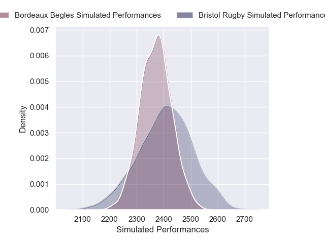
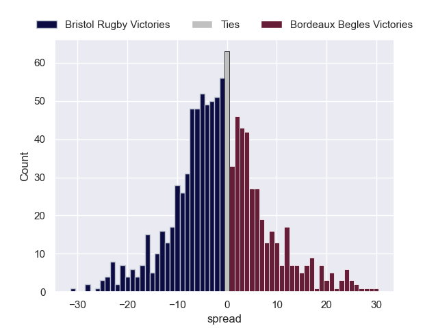

# Bristol Rugby V Bordeaux Begles on 2026/01/18, 15.0 to 27.0

# Club Level Predictions

Now that the game has been played, lets see how the club predictions did. I predicted Bristol Rugby to win by 1.87, and Bordeaux Begles won by 12.0. That's an absolute error of 13.9 for the margin of victory, while my average absolute error has been 13.6 over the past six months. This prediction was more accurate than 36.8% of my recent predictions.

For the Over/Under model, I predicted a total of 61.5 and we have an actual total of 42.0. That's an absolute error of 19.5 compared to a six month average of 12.9. This prediction was more accurate than 22.8% of my recent predictions.
## Projected Performances - Club Model

## Projected Spreads - Club Model

## Projected Results - Club Model

