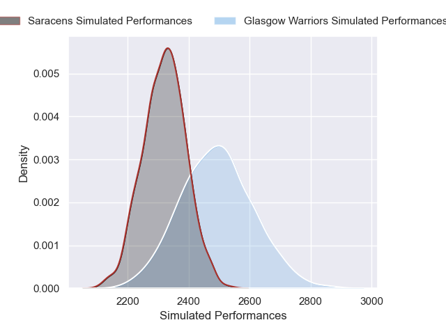

# Glasgow Warriors V Saracens on 2026/01/18, 28.0 to 3.0

# Club Level Predictions

Now that the game has been played, lets see how the club predictions did. I predicted Glasgow Warriors to win by 4.67, and Glasgow Warriors won by 25.0. That's an absolute error of 20.3 for the margin of victory, while my average absolute error has been 13.6 over the past six months. This prediction was more accurate than 23.2% of my recent predictions.

For the Over/Under model, I predicted a total of 51.5 and we have an actual total of 31.0. That's an absolute error of 20.5 compared to a six month average of 12.9. This prediction was more accurate than 20.0% of my recent predictions.
## Projected Performances - Club Model

## Projected Spreads - Club Model

## Projected Results - Club Model

