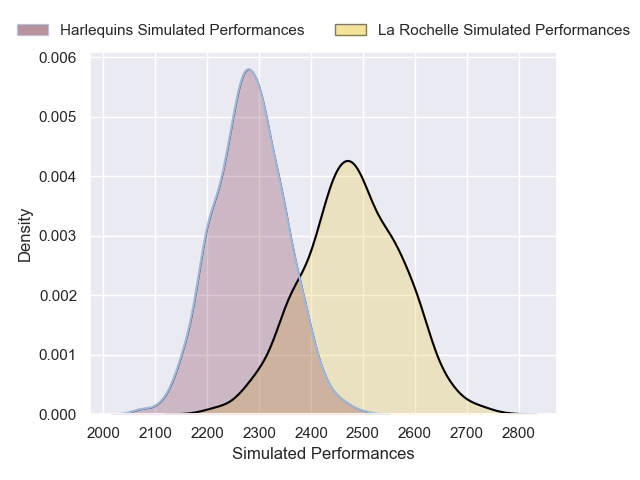
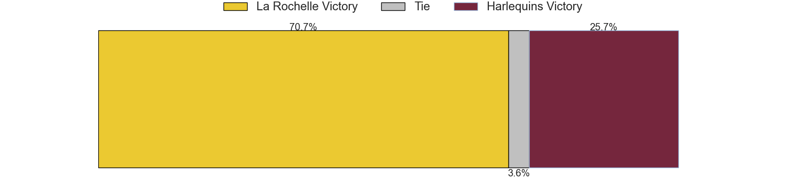

# La Rochelle V Harlequins on 2026/01/18, 17.0 to 27.0

# Club Level Predictions

Now that the game has been played, lets see how the club predictions did. I predicted La Rochelle to win by 6.9, and Harlequins won by 10.0. That's an absolute error of 16.9 for the margin of victory, while my average absolute error has been 13.6 over the past six months. This prediction was more accurate than 29.3% of my recent predictions.

For the Over/Under model, I predicted a total of 58.5 and we have an actual total of 44.0. That's an absolute error of 14.5 compared to a six month average of 12.9. This prediction was more accurate than 35.0% of my recent predictions.
## Projected Performances - Club Model

## Projected Spreads - Club Model

## Projected Results - Club Model

