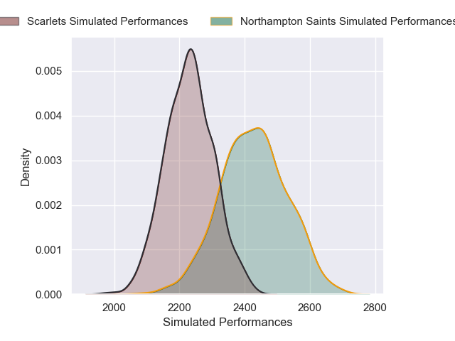

# Northampton Saints V Scarlets on 2026/01/18, 43.0 to 28.0

# Club Level Predictions

Now that the game has been played, lets see how the club predictions did. I predicted Northampton Saints to win by 6.11, and Northampton Saints won by 15.0. That's an absolute error of 8.9 for the margin of victory, while my average absolute error has been 13.6 over the past six months. This prediction was more accurate than 52.8% of my recent predictions.

For the Over/Under model, I predicted a total of 56.5 and we have an actual total of 71.0. That's an absolute error of 14.5 compared to a six month average of 12.9. This prediction was more accurate than 35.0% of my recent predictions.
## Projected Performances - Club Model

## Projected Spreads - Club Model

## Projected Results - Club Model

