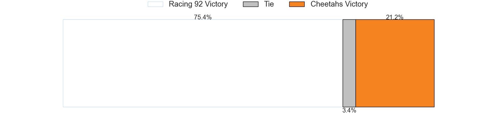

# Racing 92 V Cheetahs on 2026/01/18, 31.0 to 28.0

# Club Level Predictions

Now that the game has been played, lets see how the club predictions did. I predicted Racing 92 to win by 9.01, and Racing 92 won by 3.0. That's an absolute error of 6.0 for the margin of victory, while my average absolute error has been 13.6 over the past six months. This prediction was more accurate than 68.7% of my recent predictions.

For the Over/Under model, I predicted a total of 53.5 and we have an actual total of 59.0. That's an absolute error of 5.5 compared to a six month average of 12.9. This prediction was more accurate than 73.4% of my recent predictions.
## Projected Performances - Club Model

## Projected Spreads - Club Model

## Projected Results - Club Model

