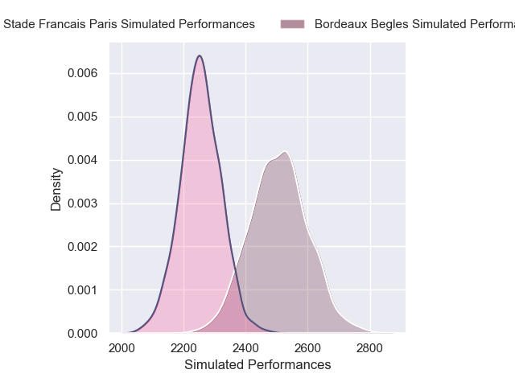
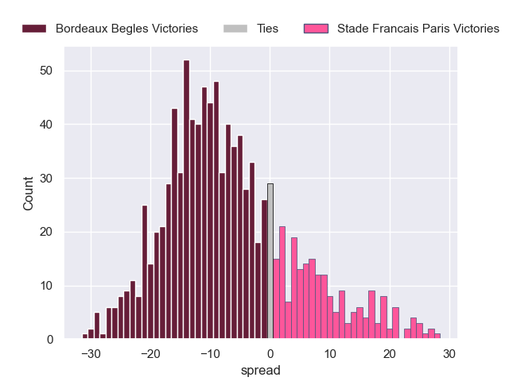
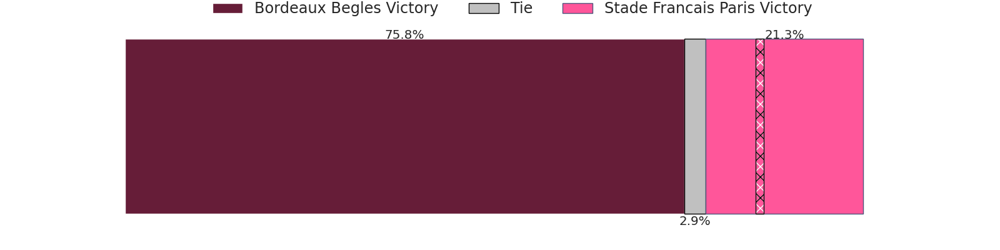

# Bordeaux Begles V Stade Francais Paris on 2026/01/24, 28.0 to 33.0

# Club Level Predictions

Now that the game has been played, lets see how the club predictions did. I predicted Bordeaux Begles to win by 5.97, and Stade Francais Paris won by 5.0. That's an absolute error of 11.0 for the margin of victory, while my average absolute error has been 13.5 over the past six months. This prediction was more accurate than 45.7% of my recent predictions.

For the Over/Under model, I predicted a total of 49.5 and we have an actual total of 61.0. That's an absolute error of 11.5 compared to a six month average of 12.7. This prediction was more accurate than 45.4% of my recent predictions.
## Projected Performances - Club Model

## Projected Spreads - Club Model

## Projected Results - Club Model

