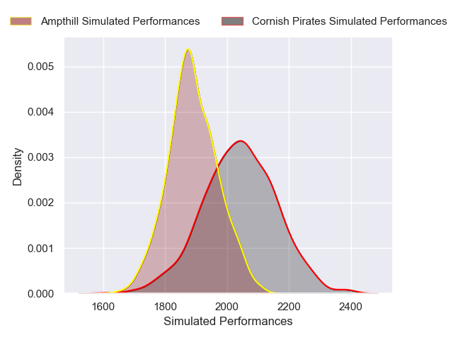
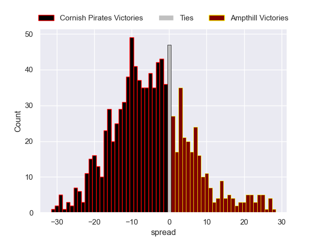

# Cornish Pirates V Ampthill on 2026/01/24, 45.0 to 24.0

# Club Level Predictions

Now that the game has been played, lets see how the club predictions did. I predicted Cornish Pirates to win by 4.04, and Cornish Pirates won by 21.0. That's an absolute error of 17.0 for the margin of victory, while my average absolute error has been 13.5 over the past six months. This prediction was more accurate than 28.8% of my recent predictions.

For the Over/Under model, I predicted a total of 58.5 and we have an actual total of 69.0. That's an absolute error of 10.5 compared to a six month average of 12.7. This prediction was more accurate than 49.0% of my recent predictions.
## Projected Performances - Club Model

## Projected Spreads - Club Model

## Projected Results - Club Model

