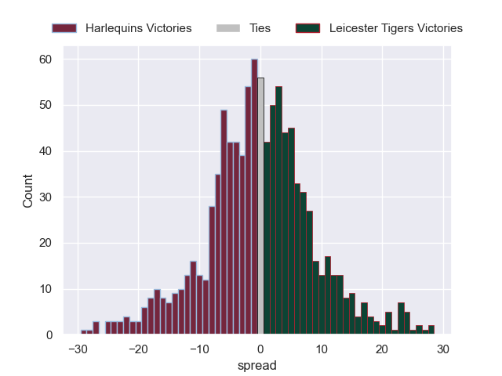

# Harlequins V Leicester Tigers on 2026/01/24, 7.0 to 34.0

# Club Level Predictions

Now that the game has been played, lets see how the club predictions did. I predicted Leicester Tigers to win by 1.05, and Leicester Tigers won by 27.0. That's an absolute error of 26.0 for the margin of victory, while my average absolute error has been 13.5 over the past six months. This prediction was more accurate than 14.4% of my recent predictions.

For the Over/Under model, I predicted a total of 60.5 and we have an actual total of 41.0. That's an absolute error of 19.5 compared to a six month average of 12.7. This prediction was more accurate than 22.5% of my recent predictions.
## Projected Performances - Club Model

## Projected Spreads - Club Model

## Projected Results - Club Model

