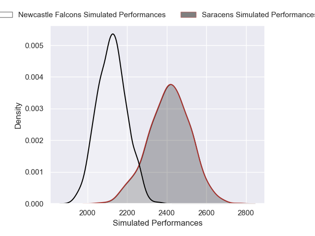

# Saracens V Newcastle Falcons on 2026/01/24, 73.0 to 14.0

# Club Level Predictions

Now that the game has been played, lets see how the club predictions did. I predicted Saracens to win by 8.02, and Saracens won by 59.0. That's an absolute error of 51.0 for the margin of victory, while my average absolute error has been 13.5 over the past six months. This prediction was more accurate than 1.6% of my recent predictions.

For the Over/Under model, I predicted a total of 52.5 and we have an actual total of 87.0. That's an absolute error of 34.5 compared to a six month average of 12.7. This prediction was more accurate than 3.4% of my recent predictions.
## Projected Performances - Club Model

## Projected Spreads - Club Model

## Projected Results - Club Model

