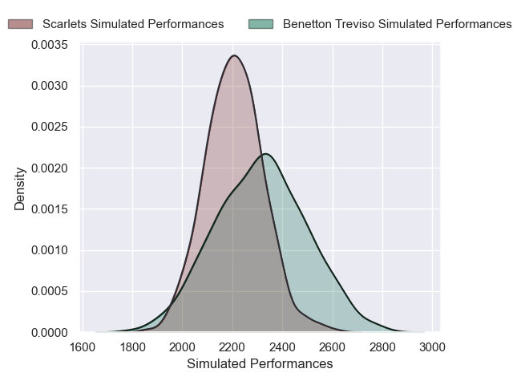
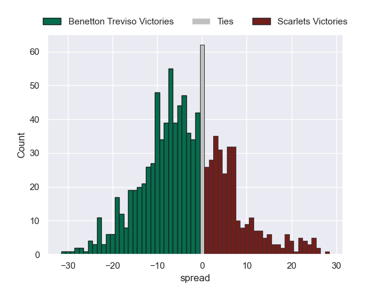
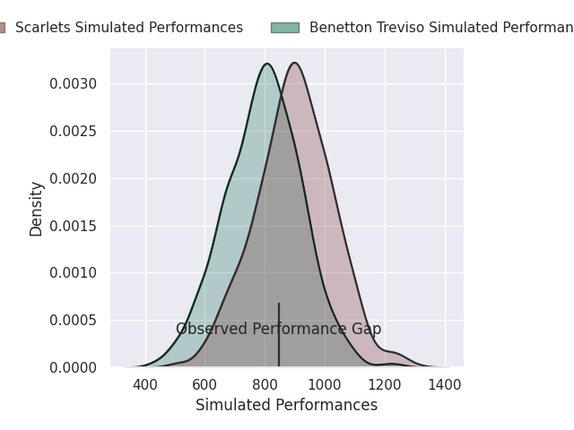
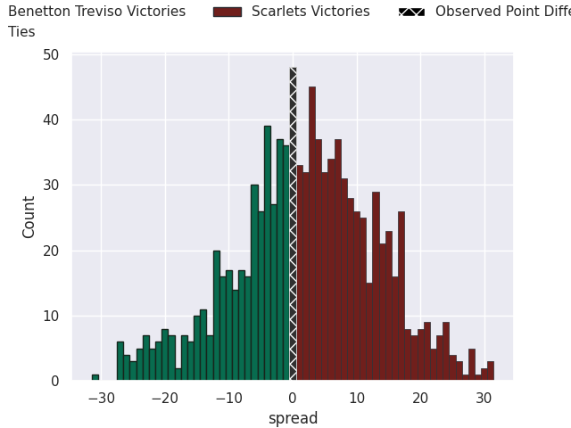

# Benetton Treviso V Scarlets on 2026/01/30, 20.0 to 20.0

# Club Level Predictions

Now that the game has been played, lets see how the club predictions did. I predicted Benetton Treviso to win by 3.66, and Scarlets won by 0.0. That's an absolute error of 3.7 for the margin of victory, while my average absolute error has been 13.3 over the past six months. This prediction was more accurate than 80.8% of my recent predictions.

For the Over/Under model, I predicted a total of 46.5 and we have an actual total of 40.0. That's an absolute error of 6.5 compared to a six month average of 12.5. This prediction was more accurate than 66.8% of my recent predictions.
## Projected Performances - Club Model

## Projected Spreads - Club Model

## Projected Results - Club Model

# Player Level Predictions

With the player model, I predicted Scarlets to win by 2.13,  and Scarlets won by 0.0. That's an absolute error of (np.float64(2.0), 1) for the margin of victory, while the average error as been 14.7 for the past six months. So this prediction was more accurate than 78.6% of my recent predictions.
## Projected Performances - Player Model

## Projected Spreads - Player Model

## Projected Results - Player Model

