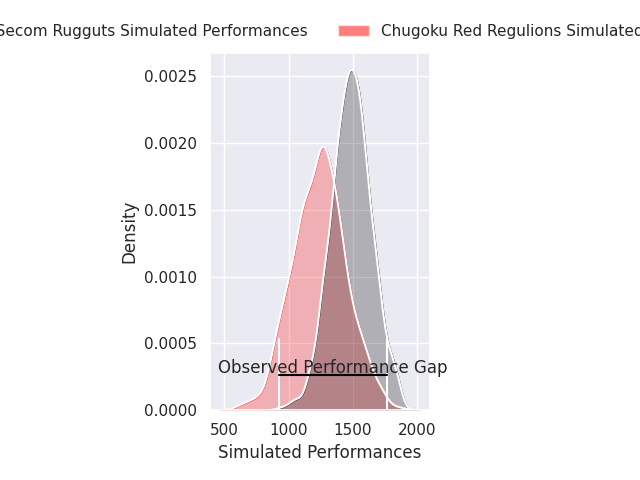
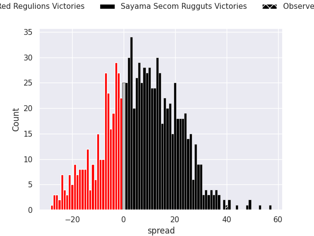
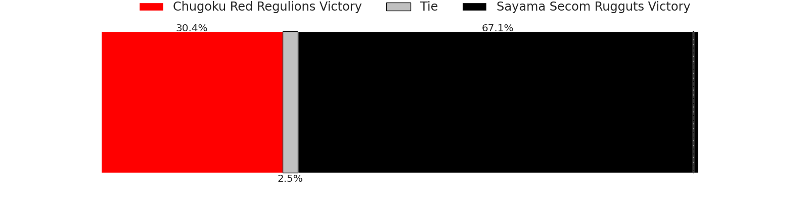
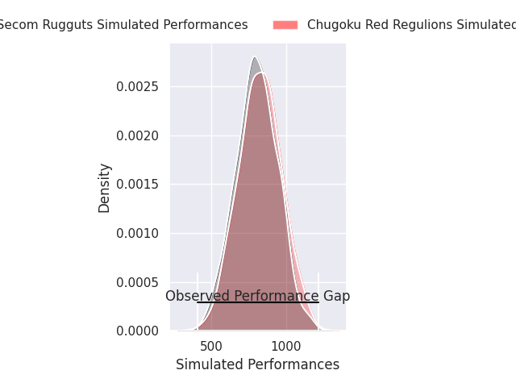
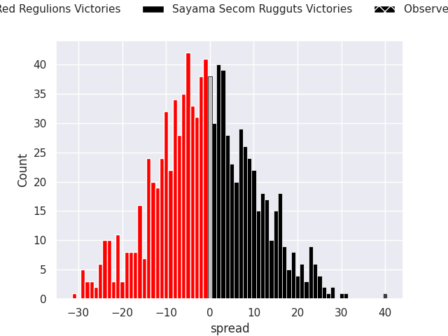
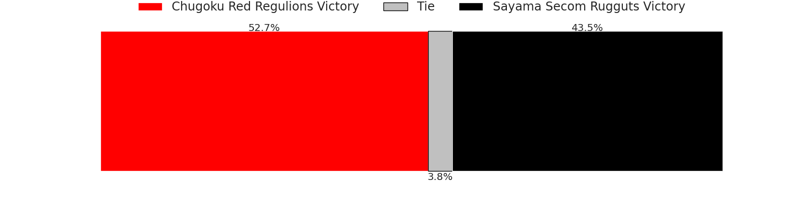

# Chugoku Red Regulions V Sayama Secom Rugguts on 2026/01/30, 0.0 to 40.0

# Club Level Predictions

Now that the game has been played, lets see how the club predictions did. I predicted Sayama Secom Rugguts to win by 6.83, and Sayama Secom Rugguts won by 40.0. That's an absolute error of 33.2 for the margin of victory, while my average absolute error has been 13.3 over the past six months. This prediction was more accurate than 7.3% of my recent predictions.

For the Over/Under model, I predicted a total of 51.5 and we have an actual total of 40.0. That's an absolute error of 11.5 compared to a six month average of 12.5. This prediction was more accurate than 45.5% of my recent predictions.
## Projected Performances - Club Model

## Projected Spreads - Club Model

## Projected Results - Club Model

# Player Level Predictions

With the player model, I predicted Chugoku Red Regulions to win by 1.01,  and Sayama Secom Rugguts won by 40.0. That's an absolute error of (np.float64(41.0), 1) for the margin of victory, while the average error as been 15.6 for the past six months. So this prediction was more accurate than 6.7% of my recent predictions.
## Projected Performances - Player Model

## Projected Spreads - Player Model

## Projected Results - Player Model

