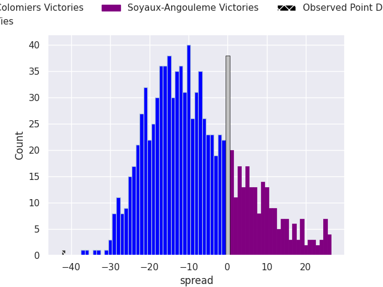
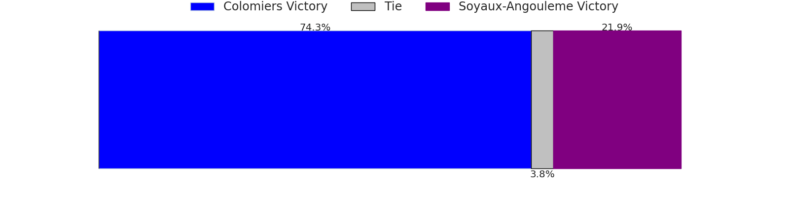
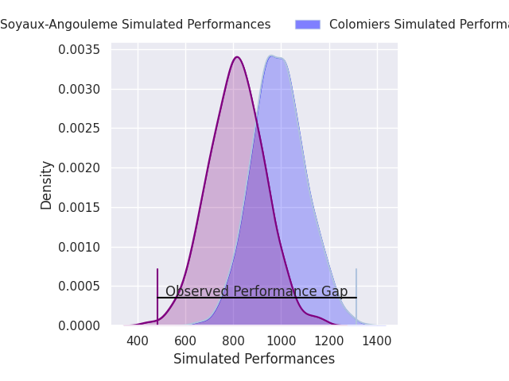
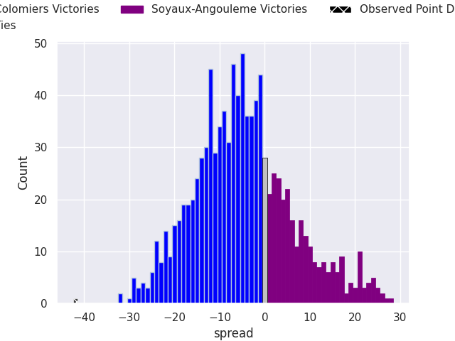
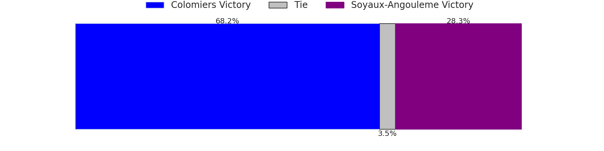

# Colomiers V Soyaux-Angouleme on 2026/01/30, 42.0 to 0.0

# Club Level Predictions

Now that the game has been played, lets see how the club predictions did. I predicted Colomiers to win by 8.16, and Colomiers won by 42.0. That's an absolute error of 33.8 for the margin of victory, while my average absolute error has been 13.3 over the past six months. This prediction was more accurate than 6.7% of my recent predictions.

For the Over/Under model, I predicted a total of 43.5 and we have an actual total of 42.0. That's an absolute error of 1.5 compared to a six month average of 12.5. This prediction was more accurate than 92.9% of my recent predictions.
## Projected Performances - Club Model

## Projected Spreads - Club Model

## Projected Results - Club Model

# Player Level Predictions

With the player model, I predicted Colomiers to win by 4.88,  and Colomiers won by 42.0. That's an absolute error of (np.float64(37.0), 1) for the margin of victory, while the average error as been 15.6 for the past six months. So this prediction was more accurate than 8.6% of my recent predictions.
## Projected Performances - Player Model

## Projected Spreads - Player Model

## Projected Results - Player Model

