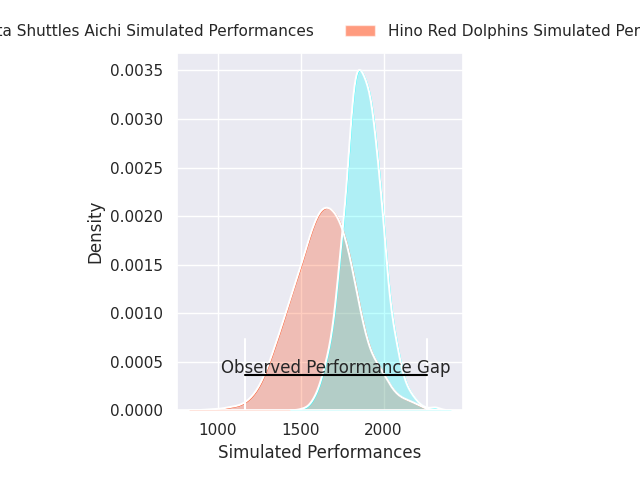
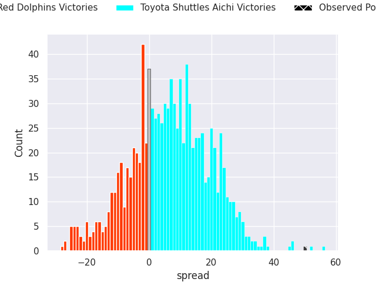
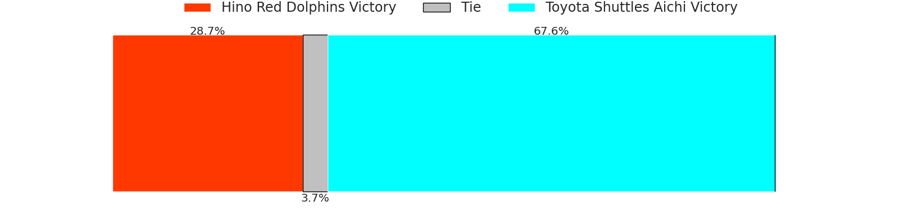
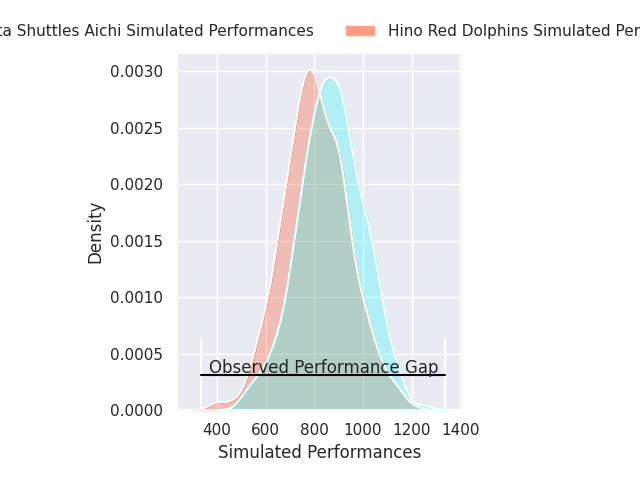
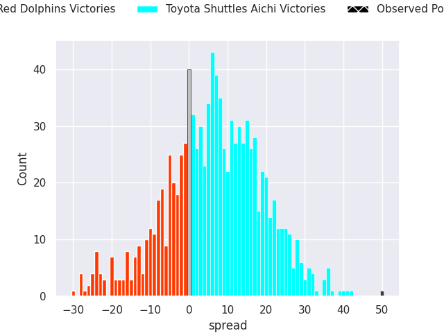
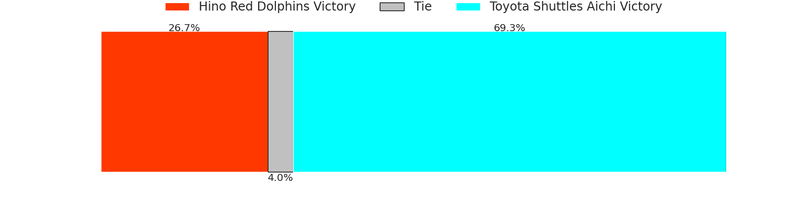

# Hino Red Dolphins V Toyota Shuttles Aichi on 2026/01/30, 12.0 to 62.0

# Club Level Predictions

Now that the game has been played, lets see how the club predictions did. I predicted Toyota Shuttles Aichi to win by 6.61, and Toyota Shuttles Aichi won by 50.0. That's an absolute error of 43.4 for the margin of victory, while my average absolute error has been 13.3 over the past six months. This prediction was more accurate than 2.7% of my recent predictions.

For the Over/Under model, I predicted a total of 55.5 and we have an actual total of 74.0. That's an absolute error of 18.5 compared to a six month average of 12.5. This prediction was more accurate than 23.2% of my recent predictions.
## Projected Performances - Club Model

## Projected Spreads - Club Model

## Projected Results - Club Model

# Player Level Predictions

With the player model, I predicted Toyota Shuttles Aichi to win by 1.64,  and Toyota Shuttles Aichi won by 50.0. That's an absolute error of (np.float64(48.0), 1) for the margin of victory, while the average error as been 15.6 for the past six months. So this prediction was more accurate than 2.8% of my recent predictions.
## Projected Performances - Player Model

## Projected Spreads - Player Model

## Projected Results - Player Model

