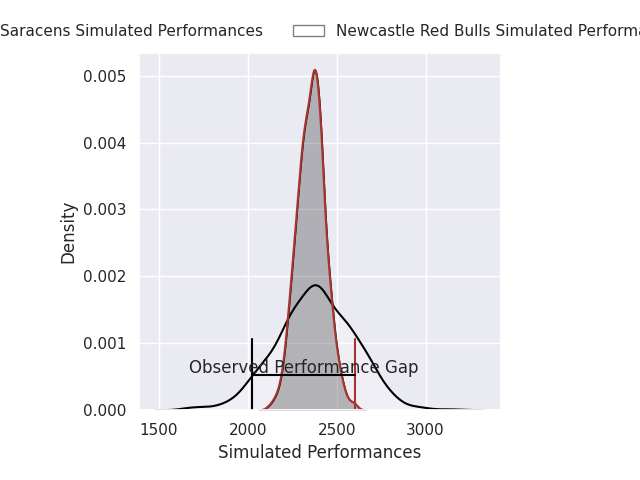
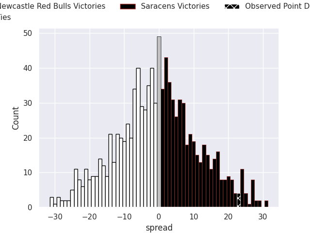
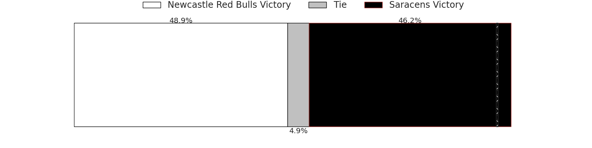
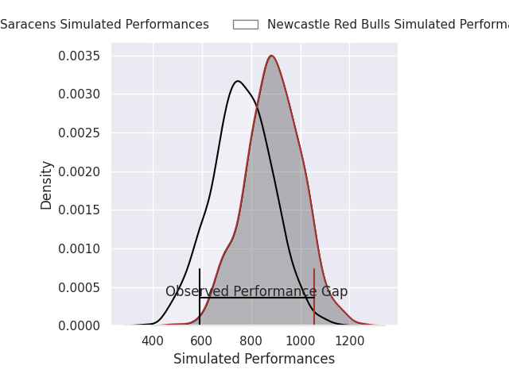
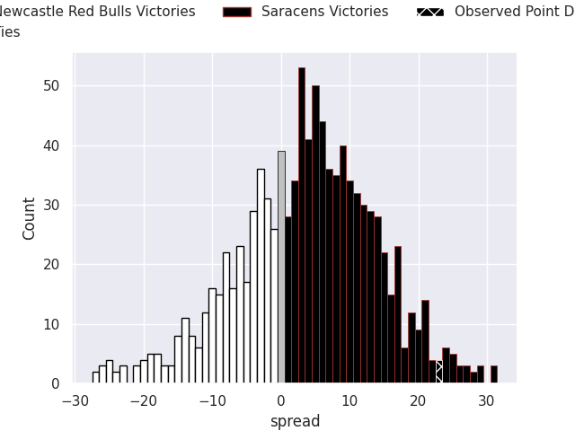

# Newcastle Red Bulls V Saracens on 2026/01/30, 12.0 to 35.0

# Club Level Predictions

Now that the game has been played, lets see how the club predictions did. I predicted Newcastle Red Bulls to win by 0.38, and Saracens won by 23.0. That's an absolute error of 23.4 for the margin of victory, while my average absolute error has been 13.3 over the past six months. This prediction was more accurate than 17.1% of my recent predictions.

For the Over/Under model, I predicted a total of 51.5 and we have an actual total of 47.0. That's an absolute error of 4.5 compared to a six month average of 12.5. This prediction was more accurate than 77.9% of my recent predictions.
## Projected Performances - Club Model

## Projected Spreads - Club Model

## Projected Results - Club Model

# Player Level Predictions

With the player model, I predicted Saracens to win by 3.78,  and Saracens won by 23.0. That's an absolute error of (np.float64(19.0), 1) for the margin of victory, while the average error as been 15.6 for the past six months. So this prediction was more accurate than 27.5% of my recent predictions.
## Projected Performances - Player Model

## Projected Spreads - Player Model

## Projected Results - Player Model

