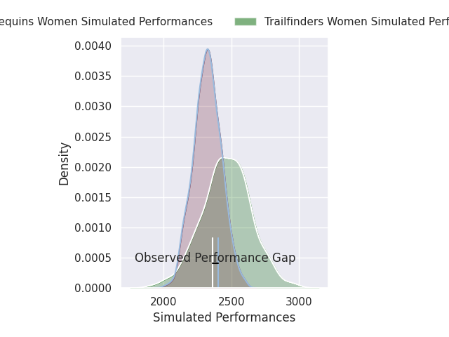
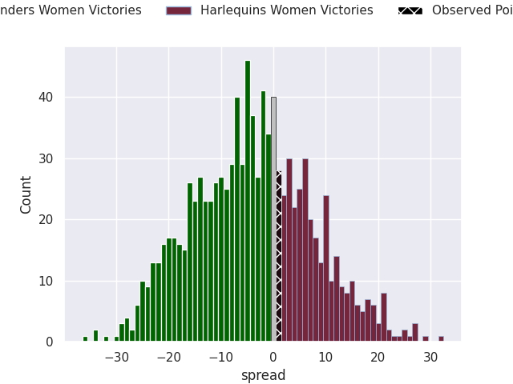

# Trailfinders Women V Harlequins Ladies on 2026/01/30, 26.0 to 27.0

# Club Level Predictions

Now that the game has been played, lets see how the club predictions did. I predicted Trailfinders Women to win by 4.12, and Harlequins Women won by 1.0. That's an absolute error of 5.1 for the margin of victory, while my average absolute error has been 13.3 over the past six months. This prediction was more accurate than 73.7% of my recent predictions.

For the Over/Under model, I predicted a total of 52.5 and we have an actual total of 53.0. That's an absolute error of 0.5 compared to a six month average of 12.5. This prediction was more accurate than 97.1% of my recent predictions.
## Projected Performances - Club Model

## Projected Spreads - Club Model

## Projected Results - Club Model

